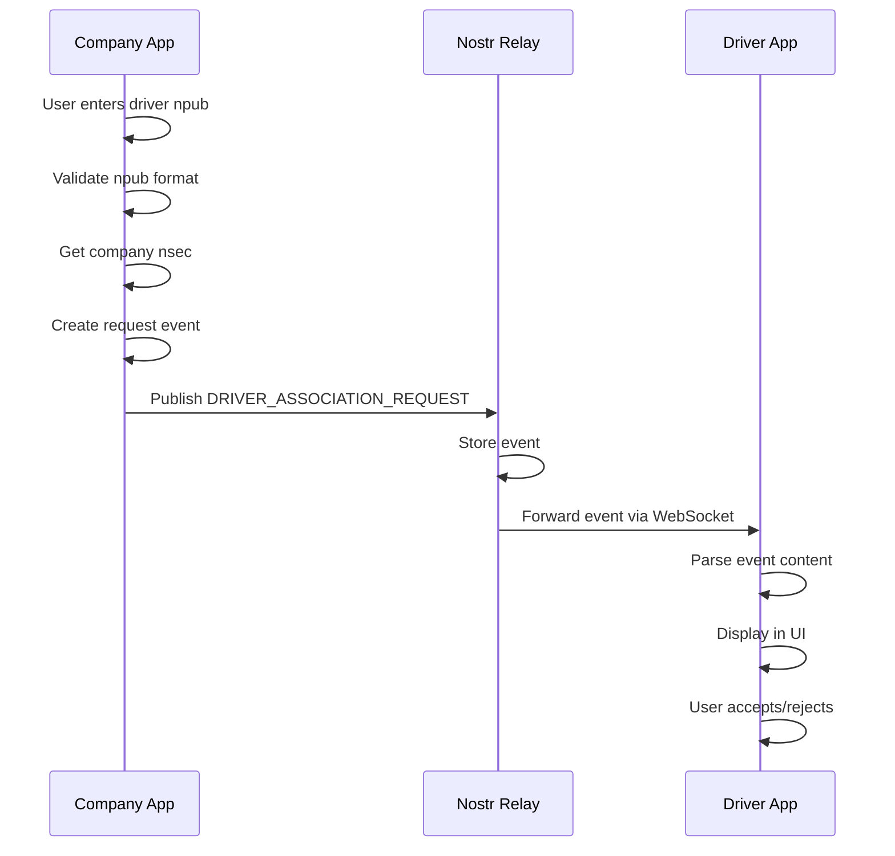
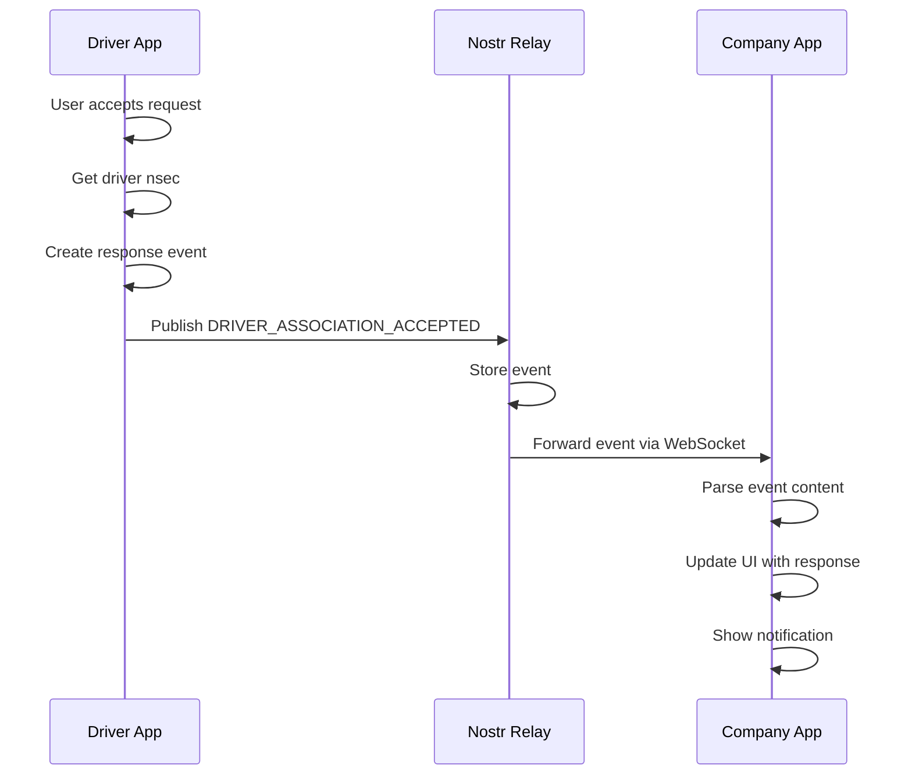

# Nostrlivery Driver Association - Technical Architecture

## System Overview

The Driver Association feature implements a real-time bidirectional communication system using the Nostr protocol, enabling companies to send association requests to drivers and receive immediate responses.

## Architecture Diagram

```
┌─────────────────┐    ┌─────────────────┐    ┌─────────────────┐
│   Company App   │    │   Driver App    │    │  Nostr Relay    │
│                 │    │                 │    │                 │
│ ┌─────────────┐ │    │ ┌─────────────┐ │    │ ┌─────────────┐ │
│ │ Drivers Tab │ │    │ │Companies Tab│ │    │ │ WebSocket   │ │
│ │             │ │    │ │             │ │    │ │ Server      │ │
│ │ - Send Req  │ │    │ │ - Listen    │ │    │ │             │ │
│ │ - Listen    │ │    │ │ - Respond   │ │    │ │ - Kind 20000│ │
│ │ - Display   │ │    │ │ - Manage    │ │    │ │ - Ephemeral │ │
│ └─────────────┘ │    │ └─────────────┘ │    │ └─────────────┘ │
└─────────────────┘    └─────────────────┘    └─────────────────┘
         │                       │                       │
         │                       │                       │
         │ 1. Publish Event      │                       │
         ├──────────────────────►│                       │
         │                       │                       │
         │                       │ 2. Forward Event      │
         │                       ├──────────────────────►│
         │                       │                       │
         │                       │ 3. Receive Event      │
         │                       │◄──────────────────────┤
         │                       │                       │
         │                       │ 4. Publish Response   │
         │                       ├──────────────────────►│
         │                       │                       │
         │ 5. Forward Response   │                       │
         │◄──────────────────────┤                       │
         │                       │                       │
         │ 6. Receive Response   │                       │
         │◄──────────────────────┤                       │
```

## Component Architecture

### 1. NostrService (Common Package)

**Location:** `common/src/service/NostrService.ts`

**Responsibilities:**
- WebSocket connection management
- Event publishing and subscription
- Cryptographic signing
- Error handling and fallbacks

**Key Methods:**
```typescript
class NostrService {
  async publishEphemeralEvent(kind: number, content: string, nsec?: string): Promise<void>
  async subscribeToEphemeralEvents(onEvent: Function, onEose: Function): Promise<Function>
  async getProfile(npub: string): Promise<Profile | null>
  private async signNostrEvent(event: any, nsec: string): Promise<any>
  private connectToRelay(): Promise<WebSocket>
}
```

### 2. Company App Components

#### AssociatedDriversScreen
**Location:** `company/src/screens/AssociatedDrivers/index.tsx`

**Features:**
- Driver npub input (manual + QR scan)
- Profile preview before sending request
- Real-time response monitoring
- Response history display

**State Management:**
```typescript
const [driverNpub, setDriverNpub] = useState("")
const [driverResponses, setDriverResponses] = useState<any[]>([])
const [isListening, setIsListening] = useState(false)
const [unsubscribeFunction, setUnsubscribeFunction] = useState<(() => void) | null>(null)
```

#### QRScanner Component
**Location:** `company/src/components/QRScanner.tsx`

**Features:**
- Camera permission handling
- QR code scanning with validation
- npub format verification

### 3. Driver App Components

#### CompaniesScreen
**Location:** `driver/src/screens/Companies/index.tsx`

**Features:**
- Real-time request listening
- Request management UI
- Accept/reject functionality
- Association tracking

**State Management:**
```typescript
const [associationRequests, setAssociationRequests] = useState<any[]>([])
const [companyAssociations, setCompanyAssociations] = useState<EntityAssociation[]>([])
const [isListening, setIsListening] = useState(false)
const [unsubscribeFunction, setUnsubscribeFunction] = useState<(() => void) | null>(null)
```

#### Profile Screen (QR Generation)
**Location:** `driver/src/screens/Profile/index.tsx`

**Features:**
- npub generation from nsec
- QR code display
- Copy to clipboard functionality

## Data Flow

### 1. Request Flow (Company → Driver)



### 2. Response Flow (Driver → Company)



## Event Schema

### Request Event
```typescript
interface DriverAssociationRequest {
  type: "DRIVER_ASSOCIATION_REQUEST"
  driverNpub: string
}
```

### Response Event
```typescript
interface DriverAssociationResponse {
  type: "DRIVER_ASSOCIATION_ACCEPTED" | "DRIVER_ASSOCIATION_REJECTED"
  companyPubkey: string
  driverNpub: string
  originalRequestId: string
}
```

### Nostr Event Structure
```typescript
interface NostrEvent {
  id: string
  pubkey: string
  created_at: number
  kind: 20000
  tags: string[][]
  content: string  // JSON stringified event content
  sig: string
}
```

## WebSocket Implementation

### Connection Management

```typescript
class WebSocketManager {
  private ws: WebSocket | null = null
  private reconnectAttempts = 0
  private maxReconnectAttempts = 5
  private reconnectDelay = 1000

  async connect(url: string): Promise<WebSocket> {
    return new Promise((resolve, reject) => {
      const ws = new WebSocket(url)
      
      ws.onopen = () => {
        this.ws = ws
        this.reconnectAttempts = 0
        resolve(ws)
      }
      
      ws.onerror = (error) => {
        reject(error)
      }
      
      ws.onclose = () => {
        this.handleReconnect(url)
      }
    })
  }
}
```

### Subscription Management

```typescript
class SubscriptionManager {
  private activeSubscriptions = new Set<string>()
  
  async subscribe(filter: any): Promise<string> {
    const subscriptionId = `ephemeral-events-${Date.now()}`
    
    const message = [
      "REQ",
      subscriptionId,
      { kinds: [20000], limit: 50 }
    ]
    
    this.ws.send(JSON.stringify(message))
    this.activeSubscriptions.add(subscriptionId)
    
    return subscriptionId
  }
  
  unsubscribe(subscriptionId: string): void {
    const message = ["CLOSE", subscriptionId]
    this.ws.send(JSON.stringify(message))
    this.activeSubscriptions.delete(subscriptionId)
  }
}
```

## Error Handling Strategy

### 1. Connection Errors
- **Automatic Reconnection**: Exponential backoff with max attempts
- **Fallback Logging**: Local storage when relay unavailable
- **User Notification**: Clear error messages in UI

### 2. Signing Errors
- **Key Validation**: Verify nsec format before signing
- **Error Recovery**: Graceful degradation without signing
- **User Guidance**: Clear instructions for key management

### 3. Parsing Errors
- **Double Encoding**: Handle both single and double-encoded JSON
- **Validation**: Verify event structure before processing
- **Logging**: Detailed error logs for debugging

## Security Considerations

### 1. Key Management
- **Secure Storage**: Use React Native secure storage for nsec keys
- **Key Rotation**: Support for key rotation and updates
- **Access Control**: Proper access control for private keys

### 2. Event Validation
- **Signature Verification**: Verify all incoming event signatures
- **Content Validation**: Validate event content structure
- **Rate Limiting**: Implement rate limiting for event publishing

### 3. Network Security
- **TLS/SSL**: Use secure WebSocket connections in production
- **Certificate Validation**: Proper certificate validation
- **Connection Encryption**: Encrypt sensitive data in transit

## Performance Optimization

### 1. Connection Management
- **Connection Pooling**: Reuse WebSocket connections
- **Lazy Loading**: Load components only when needed
- **Memory Management**: Proper cleanup of subscriptions

### 2. Event Processing
- **Batch Processing**: Process multiple events together
- **Debouncing**: Debounce rapid UI updates
- **Caching**: Cache frequently accessed data

### 3. UI Optimization
- **Virtual Scrolling**: For large lists of events
- **Image Optimization**: Optimize profile pictures
- **State Management**: Efficient state updates

## Testing Strategy

### 1. Unit Tests
- **Service Methods**: Test NostrService methods
- **Component Logic**: Test UI component logic
- **Error Handling**: Test error scenarios

### 2. Integration Tests
- **End-to-End Flow**: Test complete request/response flow
- **WebSocket Communication**: Test real-time communication
- **Error Recovery**: Test error recovery mechanisms

### 3. Manual Testing
- **Device Testing**: Test on real devices
- **Network Conditions**: Test with poor network conditions
- **User Scenarios**: Test real user workflows

## Deployment Considerations

### 1. Environment Configuration
- **Relay URLs**: Configurable relay endpoints
- **Event Kinds**: Configurable event kind support
- **Timeouts**: Configurable connection timeouts

### 2. Monitoring
- **Event Tracking**: Track event publishing success rates
- **Connection Health**: Monitor WebSocket connection health
- **Error Rates**: Monitor error rates and types

### 3. Scaling
- **Multiple Relays**: Support for multiple relay endpoints
- **Load Balancing**: Distribute load across relays
- **Caching**: Implement caching for better performance

## Future Enhancements

### 1. Advanced Features
- **Message Encryption**: End-to-end encryption for sensitive data
- **File Sharing**: Support for file attachments
- **Group Associations**: Support for group associations

### 2. Performance Improvements
- **Offline Support**: Support for offline operation
- **Sync Mechanisms**: Better synchronization mechanisms
- **Compression**: Data compression for large events

### 3. User Experience
- **Push Notifications**: Real-time push notifications
- **Rich Media**: Support for rich media content
- **Customization**: User-customizable UI themes
